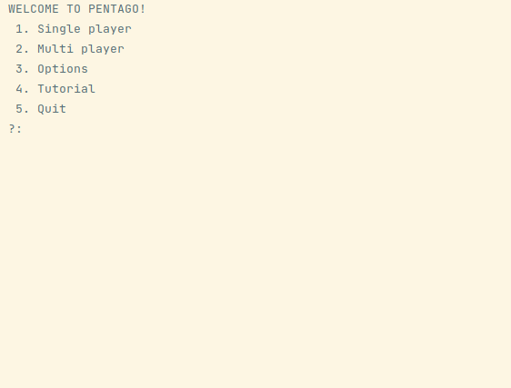
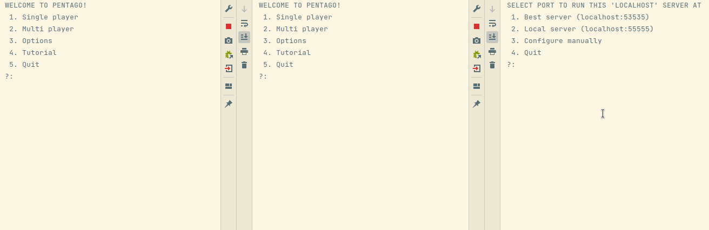

# Pentago

Pentago is a two player abstract strategical game.
This project aims to recreate it as a multiplayer game
with the possibility of either playing as a human or an AI.
Players can connect to a server and queue up for matches.

This implementation supports:
- local offline gameplay as: Human vs Human, Human vs AI, and AI vs AI
- online gameplay as a human or as an AI
- sending messages to other online players
- leaderboard ranking on the server

## Table of Contents
1. [Download](#download)  
2. [Build from source](#build-from-source)  
3. [How to play](#how-to-play)
4. [Configuration](#configuration)
5. [Documentation](#documentation)
6. [Authors](#authors)

## Download

Make sure you have installed at least **Java SE Runtime Environment 11**.
Download the latest client and server jars from the [**jar**](jar) folder and run according to your platform.

On **Linux**:
```
$ java -jar pentago-<type>.jar
```

On **Windows**: Run JAR file with **Java Platform SE binary**.
Alternatively, use the command prompt:
```
$ -jar pentago-<type>.jar
```

On **Mac**:
```
$ java -jar pentago-<type>.jar
```

On **Linux/Mac** you might need to make the JAR executable:
```
$ sudo chmod +x pentago-<type>.jar
```

## Build from source

Make sure you have at least **Java JDK version 11** (Temurin).
Git clone this repo or download a zip archive. Build in your IDE. Run `TUIClientLauncher` and/or `TUIServerLauncher`.[^1]

## How to play

For single player, simply run the `pentago-client.jar` and select "Single Player".
Go through the menus to set up the game how you want. When in game, you can always type `help`
for the game play commands.



For multi player, also run the `pentago-server.jar` to configure the server at a local port.
Then in the client select "Multi Player" and connect to the server you just set up
(server profiles can be saved for easy reuse). Go through the menus to set up how you want
to play on the server. When connected, you can always type `help` to show server and game play commands.



## Configuration

> NB: by default debug messages are disabled. These can be enabled from the Options menu.

The client application has an Options menu where you can configure various aspects of gameplay and cosmetics.
The settings you change here will be saved to the file `pentago.config` in the same directory as the client jar.
This file has to be in the same directory, otherwise defaults would be used and a new file would be generated.
Note also that the server jar needs to be in the same directory, since it also tries to read its settings from the same file.
You can always delete the `pentago.config` file to get a fresh config file with the default settings.
Of course, instead of editing the settings in the Options menu, you can also edit the config file.
Note however that some settings can only be edited in the file and are not available in the Options menu. Edit these at your own risk,
we don't provide explanations here for the various settings in the file, as this is something we don't expect the average user to use.
The Options menu is encouraged.

## Documentation

See the [**javadocs**](javadoc) folder for documentation. Open the `index.html` file in your browser and navigate the documentation at your leisure.

[^1]: Note that `TUI` stands for `Textual User Interface`. Don't expect fancy graphics, but solid gameplay.

